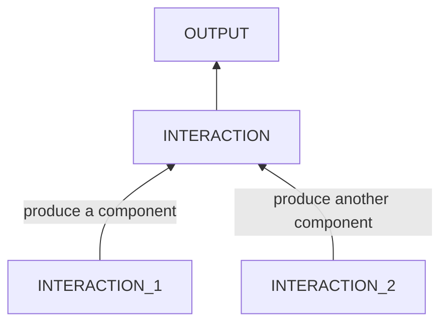
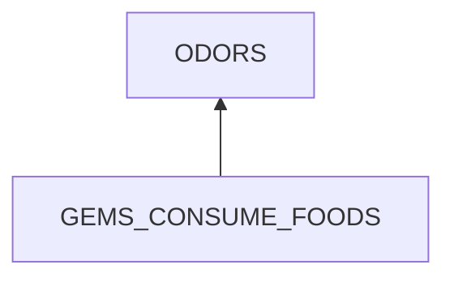
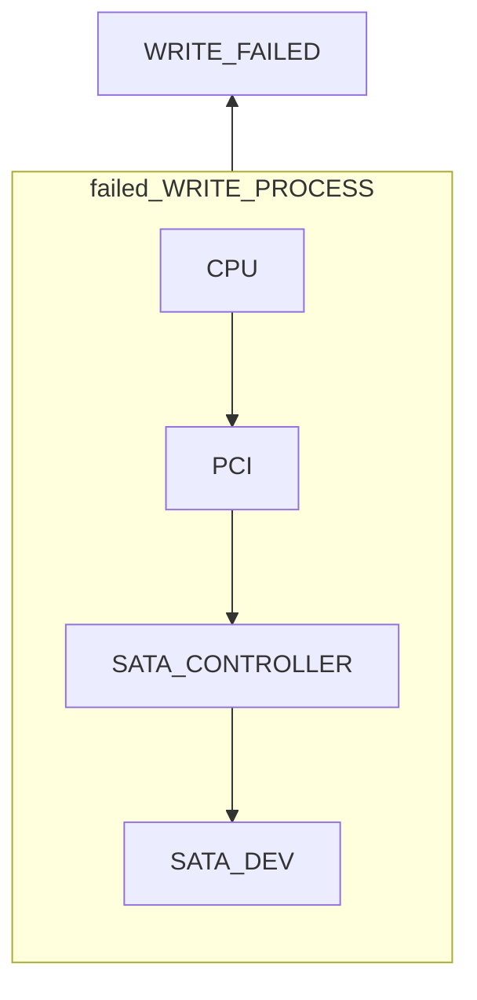
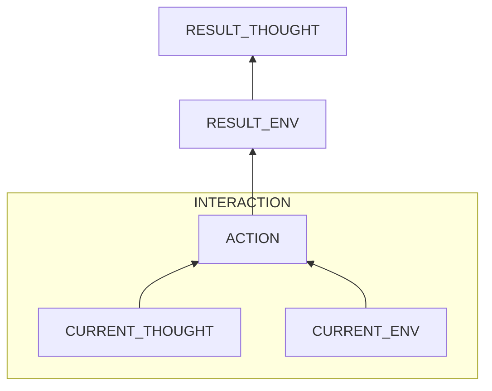
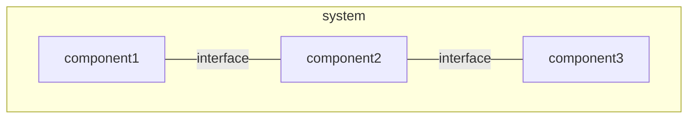

# Methodologies in Cause Analysis

## Backward Reasoning

backward root cause reasoning startsing from the final symptoms **to find the chain of causecauses of different depths.**



### THE GRAIN SIZE OF BACKWARD REASONING
When there is a clear cause-effect relation between an action A and a result B, we mark A as the cause of B.
     
For example, *the rotten smell in the kitchen* is caused by the action that *gems consume foods*.



**However, if a process consists of multiple steps or components and we can not make sure which step or component causes the problem, we make the whole process as the cause firstly then use trouble shooting to find the problematic components.**

For example, a failed write to the disk is caused by a failed write process which consists of many components including the CPU, PCI, SATA controller and SATA device.


### Problem Categories

#### physiological problems
- [x] mold smell
	```mermaid
		flowchart BT
			SMELL
			MOLDS_CONSUME_FOODS --> SMELL
			subgraph MOLDS_ENV
				TEMP
				MOISTURE
				LIGHT
				AIR
			end
			MOLDS_ENV -->|molds| MOLDS_CONSUME_FOODS
			STORAGE -->|foods| MOLDS_CONSUME_FOODS
		    
	```
- [x] rotten smell in the kitchen
	```mermaid
		flowchart BT
				SMELL
				BACTERIAS_EAT_FOODS --> SMELL
				subgraph BAC_ENV
					TEMP
					WATER
					LIGHT
					AIR
				end
				BAC_ENV -->|bacterias| BACTERIAS_EAT_FOODS
				NOT_CLEAN -->|foods| BACTERIAS_EAT_FOODS
	```
- [x] bad sleep
	```mermaid
			flowchart BT
				SLEEP_INTERRUPTED
				failed_GOOD_SLEEP_ENV --> SLEEP_INTERRUPTED
	```
	A good sleep env:
	- external
		- temperature: cool
		- light: dark
		- sound: quite 
	- internal
		- short-term
			- breath: fluent
			- stomach: not empty
			- posture: comfortable
			- bladder: empty
		- long-term
			- biological clock
			- related diseases  
					
#### engineering problems 
- Mechanics
	- Bike
		- [x] brake disc adjustment to avoid friction
			```mermaid
				flowchart BT
					FRICTION
					failed_DISC_PARALLEL_CATCHERS --> FRICTION
			```
			DISC
			: - disc: well-formed
			  - flat
			  - perpendicular to the hub axis
			  - fastener: tight 
				
			CATCHERS
			: stable
			
			INTERFACE
			: parallel
             - [x] speed shifter system 
          
	- Chair
		- [x] rubber strip fastener
			```mermaid
				flowchart BT
					failed_GAP_CATCH_STRIP --> STRIP_OUT
			```
			GAP: 
			- strong
hard
			- not broken
			    
			STRIP:
			- elastic
			- not broken
				
			CATCH:
			- match
			- tight	
			- no pull
- Electronics
	- Laptop
		- Cannot write to the disk. Find the broken component.
			```mermaid
				flowchart BT
					failed_WRITE_PROCESS --> DISK_WRITE_ERRORS
			```
			CPU:
			PCI:
			Sata Controller:
			Sata Device: well functional
			Interfaces: not loose
				
#### psychological & behavioral problems

- forget the phone
	```mermaid
			flowchart BT
				PHONE_LEFT
				subgraph forgot
					ZHOU_FORGOT_PHONE 
					NO_CHECKING_IDEA
					PHONE_IN_MOTORBIKE
				end
				ZHOU_FORGOT_PHONE --> PHONE_LEFT
					NO_CHECKING_IDEA --> ZHOU_FORGOT_PHONE
					PHONE_IN_MOTORBIKE --> ZHOU_FORGOT_PHONE
				subgraph put
				ZHOU_PUT_PHONE --> PHONE_IN_MOTORBIKE
				UNCOMFORTABLE --> ZHOU_PUT_PHONE
				PHONE_WITH_HIM --> ZHOU_PUT_PHONE
				end
				subgraph bring
				ZHOU_BRING_PHONE --> PHONE_WITH_HIM
				USAGES --> ZHOU_BRING_PHONE
				PHONE_AT_HOME --> ZHOU_BRING_PHONE
				end
	```
- anxiety of differencies
	```mermaid
			flowchart BT
				ANXIETY
				I_WORRY_DIFFERENCES --> ANXIETY
				BAD_PREDICTION --> I_WORRY_DIFFERENCES
				DIFFERENCES --> I_WORRY_DIFFERENCES
				MEMORY_LOSS --> DIFFERENCES
				KNOW_OUTDATED --> DIFFERENCES
	```	
## Trouble Shooting

For each interaction, if we need to find from multiple components which contribute to the result the most,
1. **organize involved components** by forward analysis of the process flow. To know what happened,
   - ==know of involved components by hints from error messages if existing==
   - ==study the structure systematically==
2. **find the contributing ones** by unit tests. 

### Forward Analysis 
#### Principles
-	Any component broken will make the whole path broken.

-	It is rarely possible that two independent things break at the same time.
  
	For example, for a broken path P, if the problem is still here after replacing a component A with an alternate A', then the probability that the problem is inside the part P - A is much higher than the probability that both A and A' are problematic.


#### Bad Interaction

When the output is from an interaction that should not exist at all,
-	if components can be removed easily like cases of the mold, smell and mental health problems, apply forward analysis on the interaction and remove components to break the interaction.
-	if components can be hardly replaced like case of legacy systems or body flows, focus on the interfaces. Change interfaces to reduce bad effects.

#### Failed Good Interaction

If output is from an interaction that should exist but failed (**its components and interfaces** are required but problematic) like the laptop write failures, frictions in brake system, bad speed switch system and chair stripe come-out, apply forward analysis on the expected good interaction, then replace problematic components or adjust interfaces.



##### Possible problems
- composite
	- any component or interface
- leaf
	- missed
	- weak strength
	- deformed
	- wrong function (for units whose problems cannot be seen from out appearance likes electronic devices.)
- interface (mainly for engineering problems)
	- mismatched form factors
	- loosen or separated or disposition
		- natural aging
		- external interruption
		       
### Unit Tests

Use **unit tests** to find contributing factors to the output. recursively apply this step if a contributing factor is composite.
     
When direct tests are hard, use **hypothetical deduction** and try to remove the causes starting from ones with the most evidence. 

## Removal of Causes

- removal
	-	replacement
		- hard: replace the physical object
		- soft: turn on / off it	
	-	repair
		-	remove a component / interface
		-	change an attribute
		-	change the action	

**By changing touchable physical objects** to remove causes. 
- ==This removal means that the object is present here.== 
- ==To avoid its presentation is prevention.==

### Action 
For actions, there are 3 cases in terms of the subject.
- if the subject is a human, remove
	- thought by external reminders.
	> Notice: 
	> - to prevent the thought, change the person's environment to help the person be more informed.    
	> - not try to change the subject brutally.
	- its environment by external forces
		- change the object's state
		- import external constraints

-	if the subject is a nonhuman but organism, remove thought, **itself** or its env. 
-	if the subject is a nonliving physical object, then the thought is actually physical rules which cannot be altered. In this case, remove itself or env.

For interactions in which multiple components mix up like those in biology, focus on components not interfaces.
<!--stackedit_data:
eyJoaXN0b3J5IjpbLTE0MTczNzYxOTUsLTg2NTUyNjY0MCwtMT
MyNzcyODI3NCwyOTA5NDA1MTldfQ==
-->