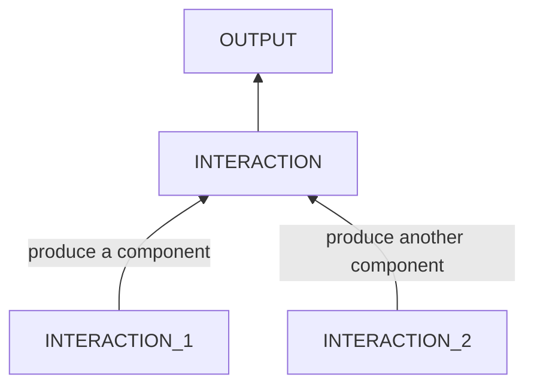

# Methodologies in Cause Analysis
1. backward root cause reasoning starting from the final symptoms **to find causes of different depths.**

  - physiological problems
	- [x] mold smell
		```mermaid
		flowchart BT
			SMELL
			MOLDS_CONSUME_FOODS --> SMELL
			subgraph MOLDS_ENV
				TEMP
				MOISTURE
				LIGHT
				AIR
			end
			MOLDS_ENV -->|molds| MOLDS_CONSUME_FOODS
			STORAGE -->|foods| MOLDS_CONSUME_FOODS
		    
		```
	- [x] rotten smell in the kitchen
		```mermaid
		flowchart BT
				SMELL
				BACTERIAS_EAT_FOODS --> SMELL
				subgraph BAC_ENV
					TEMP
					WATER
					LIGHT
					AIR
				end
				BAC_ENV -->|bacterias| BACTERIAS_EAT_FOODS
				NOT_CLEAN -->|foods| BACTERIAS_EAT_FOODS
		```
	- [x] bad sleep
		```mermaid
			flowchart BT
				SLEEP_INTERRUPTED
				failed_GOOD_SLEEP_ENV --> SLEEP_INTERRUPTED
		```
		A good sleep env:
		- external
			- temperature: cool
			- light: dark
			- sound: quite 
		- internal
			- short-term
				- breath: fluent
				- stomach: not empty
				- posture: comfortable
				- bladder: empty
			- long-term
				- biological clock
				- related diseases  
					
  - engineering problems 
	- Mechanics
		- Bike
			- [x] brake disc adjustment to avoid friction
				```mermaid
				flowchart BT
					FRICTION
					failed_DISC_PARALLEL_CATCHERS --> FRICTION
				```
				DISC:
				- disc: well-formed
				- fastener: tight
				
				CATCHERS: stable
				INTERFACE: parallel
             - [ ] speed switch system 
		- Chair
             - [x] rubber strip fastener
				```mermaid
				flowchart BT
					failed_GAP_CATCH_STRIP --> STRIP_OUT
				```
				GAP: 
				- hard
				- not broken
			    
				STRIP:
				- elastic
				- not broken
				
				CATCH:
				- match
				- tight
				- no pull
	- Eletronic
		- Laptop
			- Cannot write to the disk. Find the broken component.
			    ```mermaid
				flowchart BT
					failed_WRITE_PROCESS --> DISK_WRITE_ERRORS
				```
				CPU:
				PCI:
				Sata Controller:
				Sata Device: well functional
				Interfaces: not loose
				
  - psychological & behavioral problems
	```mermaid
	flowchart BT
		RESULT_ENV --> RESULT_THOUGHT
		ACTION --> RESULT_ENV
		subgraph INTERACTION
			CURRENT_THOUGHT --> ACTION
			CURRENT_ENV --> ACTION
		end
	```
	- forget the phone
		```mermaid
			flowchart BT
				PHONE_LEFT
				subgraph forgot
					ZHOU_FORGOT_PHONE 
					NO_CHECKING_IDEA
					PHONE_IN_MOTORBIKE
				end
				ZHOU_FORGOT_PHONE --> PHONE_LEFT
					NO_CHECKING_IDEA --> ZHOU_FORGOT_PHONE
					PHONE_IN_MOTORBIKE --> ZHOU_FORGOT_PHONE
				subgraph put
				ZHOU_PUT_PHONE --> PHONE_IN_MOTORBIKE
				UNCOMFORTABLE --> ZHOU_PUT_PHONE
				PHONE_WITH_HIM --> ZHOU_PUT_PHONE
				end
				subgraph bring
				ZHOU_BRING_PHONE --> PHONE_WITH_HIM
				USAGES --> ZHOU_BRING_PHONE
				PHONE_AT_HOME --> ZHOU_BRING_PHONE
				end
		```
	- anxiety of differencies
		```mermaid
			flowchart BT
				ANXIETY
				I_WORRY_DIFFERENCES --> ANXIETY
				BAD_PREDICTION --> I_WORRY_DIFFERENCES
				DIFFERENCES --> I_WORRY_DIFFERENCES
				MEMORY_LOSS --> DIFFERENCES
				KNOW_OUTDATED --> DIFFERENCES
		```	
2. For each interaction, forward analysis of the process flow **to organize involved components** 
     - **Principle: Any component broken will make the whole path broken.**
     - ==supports Why we learn from materials systematically.==
	 1. if the output is from an interaction that should not exist (its components should not exist) at all like the mold, smell and mental health problems, apply forward analysis on the interaction and remove components.
	 2. else if output is from an interaction that should exist but failed (**its components and interfaces** are required but problematic) like the laptop write failures, frictions in brake system, bad speed switch system and chair stripe come-out, apply forward analysis on the expected good interaction, then replace problematic components or adjust interfaces.
		```mermaid
		flowchart 
			subgraph system
				component1 ---|interface| component2 ---|interface| component3
			end
		```
		- problems
		  - composite
		    - any component or interface
		  - leaf
		    - missed
		    - weak strength
		    - deformed
		    - wrong function
		  - interface
		    - mismatched form factors
		    - loosen or separated or disposition
		      - natural aging
		      - external interruption       
3. Use **unit tests** to find contributing factors to the output. recursively apply this step if a contributing factor is composite.
     
	 When direct tests are unavailable, use deduction from observation about components or **hypothetical deduction**. 
4. **By changing touchable physical objects** to remove causes.
 
	 For actions, change the person's 
	 - thought by change the person's environement by
		 - know more examples to get an objective view.    
	 - or its environment by
		 - change the object's state
		 - import external constraints
5. For interactions in which multiple components mix up like those in biology, focus on components not interfaces.
<!--stackedit_data:
eyJoaXN0b3J5IjpbMTkxMjI4MDcxNV19
-->