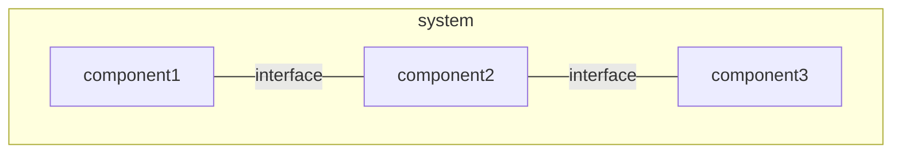
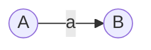
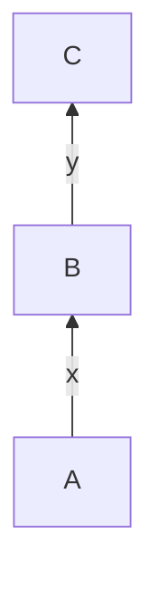
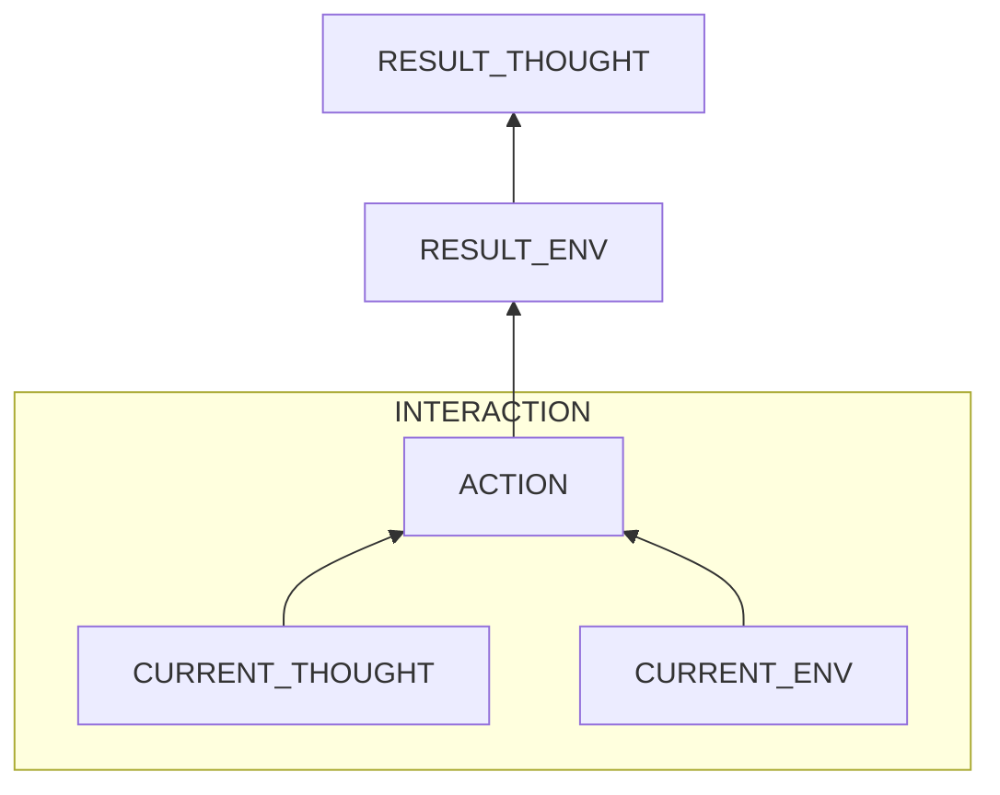

# Methodologies in Cause Analysis


The first type is based on 
- stable rules like *there are 2 objects with opposite charges -> then they attract each other*.
- human rules like *the shoes are expensive -> do not buy them*.

The second type is based on natural rules like *washing clothes -> clothes are clear.* 

Except for math rules and some most basic physical/chemical rules, most rules are NOT sufficiently right, as there are many factors in real life. Also, they are NOT necessary right, as a result can have many different causes.

In problem solving, we reason backwards from results to causes to build the path. 

## Problem Types

### Bad Interaction

A bad interaction is one in which components and interfaces should not exist. For instance, the interaction that *Germs consume food remains* in the problem of bad smell.
 
To handle this type, 
-	if components can be removed easily like cases of the mold, smell and mental health problems, apply forward analysis on the interaction and remove components to break the interaction.
-	if components can be hardly replaced like case of legacy systems or body flows, focus on the interfaces. Change interfaces to reduce bad effects.

### Failed Good Interaction

If output is from an interaction that should exist but failed (**its components and interfaces** are required but problematic), it is a failed good interaction. This type includes problems like the laptop write failures, frictions in brake system, bad speed switch system and chair stripe come-out.

For this type, apply forward analysis on the expected good interaction, then replace problematic components or adjust interfaces.



#### Possible problems
- composite
	- any component or interface
- leaf
	- missed
	- weak strength
	- deformed
	- wrong function (for units whose problems cannot be seen from out appearance likes electronic devices.)
- interface (mainly for engineering problems)
	- mismatched form factors
	- loosen or separated or disposition 
		- natural aging
		- external interruption

### Side Effects

If an interaction is good and successful, but there is something bad **not related to our goals**, then the problem is a side effect. Based on the behavior model, it can be
-	damage to the object
-	exhaustion of the subject
-	something bad in the env

The side effect can be caused by
- inappropriate manners
	- intensity
	- angle
	- pace 
- weakness of the subject or object. 
- not enough clean-up procedure.	

**Analyse the current process to find out which step causes the side effect.**


## Models

### Principle

#### Causation

Every object is at some state each instant. When action is done to it, it is changed to another state. An action is a series of states which has a meaning.



Two types of causation are involved.
- A -> a : a state triggers an action
- (A, a) -> B : an action results in another state. 

#### Rules

Causation is controlled by rules. There are 2 types of rules - stable and human rules.

~~For different types of rules, backwards reasoning focuses on states or actions.~~
##### Stable Rules

Stable rules means rules that are usually treated as correct. These include 
- natural rules which could not be changed.
- engineering rules which stand after long-term tests.

For Stable rules, backwards reasoning focuses on states. 

###### Triggers

For the causation that a state triggers a process, the needed triggering state can be of one of two types in terms of diffrent types of stable rules.

- For natural rules, the state usually only needs to include the static structure. The process will spontaneously happen. For instance, if there are two objects with opposite electrical charges, they will attract each other. 
- For engineering rules, besides the static machine,
	- to start a general process, some forms of additional energy are needed as input. Force is needed to turn a bike. Electricity is needed to light a bulb. Water is needed for transferring water through a pipe. Two numbers are needed for a computer to start an add operation.
	- to start a specific process, besides energy, some semantic conditions in the rules of the subject are needed to met, which are usually mathematical judgement. For instance, if the temperature is below 25 degrees, the air conditioning hibernates. 

###### Process Types

Stable processes can be divided into 2 types. Based on the type, different methodologies of analysis are used to extend the path. 

Expected
:	both the structure and triggers should exist.

	For instance, in the process of powering a machine, both the structure (the machine) and trigger (electricity) should exist.

	Because components of a system should be here, we localize the problematic component to an atomic level, from which we reason its causing process.
	
Unexpected
:	Some components of the system should not exist. 

	In the process of germs consuming foods, the structure (germs and foods) should not exist. In another process of oomd killing chrome, the structure (oomd and chrome) should be there, but the condition to kill chrome in oomd's policies (when chrome's memory usage exceeds 60% of all memory) should not be met. 

	For this type, we find all components that should not exist, and then reason back from each of these components individually.
	
##### Human Rules

Human rules means human thoughts controlling behaviors. For instance, "If my laptop has no response, then I restart it." and "If I want to compare two things, then I put them side by side." are human rules.

For this type, backwards reasoning focuses on behaviors. Human thoughts contain many misconceptions, and humans might miss out some steps. As a result, in a human-conducted process, it is highly possible that human behaviors introduce problems. **But previous states are also considered for cases in which the handled objects are problematic inside.**

##### Processes

Stable Process
:	A process controlled by stable rules.

Human Process
:	A process controlled by human rules.


### Backward Reasoning

backward root cause reasoning starts from the final symptoms **to find the chain of causes.**



Backward reasoning is used to find a meaningful process resulting in the current state, and then the previous state triggering the process. It is the general method to find causes.

#### Starting Points

Start the whole cause analysis process from the effects of the problem on us. For instance, An effect is the itchy feeling not the existence of mosquitoes.

#### Find the process

Find the process resulting in a problematic state. 

- For human processes, focus on the process itself.
- For stable processes, focus on the before state.

==A macroscopic human action will trigger an underlying microscopic stable process, so until the problem is the presence or absence of the whole object due to human processes like the case of keys lost or garbage introduced, always start from stable process and find problematic components.==


#### Trouble Shooting

Trouble shooting is a process in which we localize the problem in order to minimize the cost of repair. We use it for both types of rules.

##### Problematic Components

For a stable process, trouble shooting is used to find problematic components of a system. Because stable rules are correct, if a state is problematic, then the previous state before the process is **possibly** problematic. 

> Notice: natural aging is taken into consideration. 

The procedure is
1. **organize involved components**
	- structure	
		- study from materials **if**
			- the location of a system is hard to reach. For instance, a bulb attached to the ceiling.
			- a system is encapsulated & disassembling it is risky like electronic devices.
		- examine the structure with goal orientation in which we firstly think what the system needs and then find the component implementing the functionality.
	- trigger
		- check requirements of energy or judgement from rules
	- *environment*
		- if the system operates in harsh environment like outside, the env is considered. 
2. **prove the contributing ones**. 
3. for a problematic component, repeat above steps till the current component is atomic, which means that the cost of repairing its components is greater than that of replacement of whole one.
 
Trouble shooting has many benefits.
- reduces the cost of repair the system
- narrows down the range of causes from that of the whole system to that of a component, which simplifies further backwards reasoning.
- simplifies the analysis of the system from a static view.
 
##### Problematic Steps

For a human process, trouble shooting is used to find problematic steps in the process. To do it,
1. specify steps of the process
	- forwards if we have a plan
	- backwards otherwise
2. prove the problematic steps
3. recursively do above procedure till a step is a single action.

If eventually we find that the process is correct and the problem is from the previous state, which means that environment makes the process hard to achieve the required effect, suck as tools used are too weak or not flexible, then continue backwards reasoning.

##### Localization Level

To localize to a level where the cost of replacement is less than that of repair like:
- an atomic level
	- engineering units like chips and screws
	- a single physical action like pushing a button
- repair is far out of my current knowledge or control like close-source apps

#### Summary

- Backwards reasoning to build a path of individual processes.
- Trouble shooting to localize problematic parts in a process.

## Proof

To prove a possible cause Y, there are 3 types of pathes.

### Cause

A path from Y's cause X to Y.

#### Process

Evidence of a process X which can cause Y. 

#### Related Objects

Evidence of other objects which can be produced along with Y by X.

### Hypothetical Deduction
		  
A path from Y to another possible symptom Z besides the current problem.

### Test

We can directly test Y. There are 2 types of tests.
- date from others.
- unit tests by ourselves.

#### Reference

We can refer to others' test results, which needs extremely caution about fake evidence.

#### Unit Tests

Unit tests are to test Y by ourselves.

##### Principles
-	Any component broken will make the whole path broken.

-	It is rarely possible that two independent things break at the same time.
  
	For example, for a broken path P, if the problem is still here after replacing a component A with an alternate A', then the probability that the problem is inside the part P - A is much higher than the probability that both A and A' are problematic.#### Ability

There are 2 challenges in finding contributors of a problem. 

Firstly, whether a part is problematic.
- Macro ones can be caught easily with five senses, like a loosen screw, a deformed gadget and cracks in mechanics.
- Micro ones not, like electronic units and chemicals.

Secondly, even if a part is problematic, it is NOT 100 percent that this part really causes the final problem. For instance, a machine might still work well when a screw is loosen or rusted. It is the degree of being problematic and combination with other factors that decide the effect.

Unit tests can decide both **the existence of a factor** and **the causation relationship between the factor and the outcome**. When replacing a component with one already verified good,
- if the problem disappears, then this component is both problematic and causing the bad result.
- **otherwise, we can only make sure that there is at least one other factor.**

##### Types

###### Positive

A positive unit test is one where we test a suspected part *A* in a new env in which all other parts are good.
- if the system works well, then A is good or bad, but not causing the problem.
- else A is bad, and causing the problem.

**For software systems, positive unit tests are easy to conduct.** We can mock all its dependencies and the caller.

For Hardware systems, they are hard.
- for engineering, we need to replace all other parts, which is expensive.
- for medical problems, it is inapplicable. We can not unit test an organ.

###### Negative

A negative unit test to a part is one test where we replace it with a verified good part. This test essentially positively tests the whole rest.

It is easier to conduct than the positive type. When we highly suspect a component, we can replace it only, then test the system.

###### Finding a working path

A system contains multiple components. To narrow down test scope, we can utilize the current system to do pseudo unit test. If a component can handle multiple case like an electronic unit can handle different data, we try to find a working case. For instance, the path of a failed write involves CPU, PCI BUS and SATA. If keyboard typing works which involves the Keyboard, USB BUS, PCI BUS and CPU, then we know that CPU and PCI work, and the problem is inside SATA. 

### Combination

1. collect evidence of five senses for different components.

2. start from the least possible ones, use pseudo unit tests to rule out most.

3. If there are more than 1 candidates left, use negative unit tests from the cheapest one. For instance of the write failure problem, if both the SATA adapter and SATA device are still possible, try to replace the SATA device firstly as replacing the SATA adapter needs to replace the whole mother board.

### Multiple Factors

If there are multiple factors contributing to the problem, we need to handle them all.

Fortunately, for engineering problems, there will be usually only one factor. If a system suddenly stops working, it is the most possible that only one component is broken according to possibility. Exceptions are when the machine has not been used for long or is physically damaged seriously.

However, biological problems are caused by many factors. 

In cases where there might be many factors, pseudo unit tests are less effective as maybe the accumulated effect causes the outcome. To handle this situation, we handle all factors by repairing them.

Even if a problematic component is not related to this problem, it is better to repair it if we notice it like the case of a loosen screw. One of reasons that it has not caused a problem might be its minor degree. As time goes by, the component gets worn more. Repairing it now could prevent problems.  


## Problem Examples

#### physiological problems
- [x] mold smell
	```mermaid
		flowchart BT
			SMELL
			MOLDS_CONSUME_FOODS --> SMELL
			subgraph MOLDS_ENV
				TEMP
				MOISTURE
				LIGHT
				AIR
			end
			MOLDS_ENV -->|molds| MOLDS_CONSUME_FOODS
			STORAGE -->|foods| MOLDS_CONSUME_FOODS
		    
	```
- [x] rotten smell in the kitchen
	```mermaid
		flowchart BT
				SMELL
				BACTERIAS_EAT_FOODS --> SMELL
				subgraph BAC_ENV
					TEMP
					WATER
					LIGHT
					AIR
				end
				BAC_ENV -->|bacterias| BACTERIAS_EAT_FOODS
				NOT_CLEAN -->|foods| BACTERIAS_EAT_FOODS
	```
- [x] bad sleep
	```mermaid
			flowchart BT
				SLEEP_INTERRUPTED
				failed_GOOD_SLEEP_ENV --> SLEEP_INTERRUPTED
	```
	A good sleep env:
	- external
		- temperature: cool
		- light: dark
		- sound: quite 
	- internal
		- short-term
			- breath: fluent
			- stomach: not empty
			- posture: comfortable
			- bladder: empty
		- long-term
			- biological clock
			- related diseases  
					
#### engineering problems 
- Mechanics
	- Bike
		- [x] brake disc adjustment to avoid friction
			```mermaid
				flowchart BT
					FRICTION
					failed_DISC_PARALLEL_CATCHERS --> FRICTION
			```
			DISC
			: - disc: well-formed
			  - flat
			  - perpendicular to the hub axis
			  - fastener: tight 
				
			CATCHERS
			: stable
			
			INTERFACE
			: parallel
             - [x] speed shifter system 
          
	- Chair
		- [x] rubber strip fastener
			```mermaid
				flowchart BT
					failed_GAP_CATCH_STRIP --> STRIP_OUT
			```
			GAP: 
			- strong
hard
			- not broken
			    
			STRIP:
			- elastic
			- not broken
				
			CATCH:
			- match
			- tight	
			- no pull
- Electronics
	- Laptop
		- Cannot write to the disk. Find the broken component.
			```mermaid
				flowchart BT
					failed_WRITE_PROCESS --> DISK_WRITE_ERRORS
			```
			CPU:
			PCI:
			Sata Controller:
			Sata Device: well functional
			Interfaces: not loose
				
#### psychological & behavioral problems

- forget the phone
	```mermaid
			flowchart BT
				PHONE_LEFT
				subgraph forgot
					ZHOU_FORGOT_PHONE 
					NO_CHECKING_IDEA
					PHONE_IN_MOTORBIKE
				end
				ZHOU_FORGOT_PHONE --> PHONE_LEFT
					NO_CHECKING_IDEA --> ZHOU_FORGOT_PHONE
					PHONE_IN_MOTORBIKE --> ZHOU_FORGOT_PHONE
				subgraph put
				ZHOU_PUT_PHONE --> PHONE_IN_MOTORBIKE
				UNCOMFORTABLE --> ZHOU_PUT_PHONE
				PHONE_WITH_HIM --> ZHOU_PUT_PHONE
				end
				subgraph bring
				ZHOU_BRING_PHONE --> PHONE_WITH_HIM
				USAGES --> ZHOU_BRING_PHONE
				PHONE_AT_HOME --> ZHOU_BRING_PHONE
				endelectronic/mechanical
	```
- anxiety of differencies
	```mermaid
			flowchart BT
				ANXIETY
				I_WORRY_DIFFERENCES --> ANXIETY
				BAD_PREDICTION --> I_WORRY_DIFFERENCES
				DIFFERENCES --> I_WORRY_DIFFERENCES
				MEMORY_LOSS --> DIFFERENCES
				KNOW_OUTDATED --> DIFFERENCES
	```	
	
## Removal of Causes

- removal
	-	replacement
		- hard: replace the physical object
		- soft: turn on / off it	
	-	repair
		-	remove a component / interface
		-	change an attribute
		-	change the action	

**By changing touchable physical objects** to remove causes. 
- ==This removal means that the object is present here.== 
- ==To avoid its presentation is prevention.==

### Component

### Action

For a bad action, the most efficient way is to change the rule.
 
For actions, there are 3 cases in terms of the subject.
- if the subject is a human, remove
	- thought by external reminders.
	> Notice: 
	> - to prevent the thought, change the person's environment to help the person be more informed.    
	> - not try to change the subject brutally.
	- its environment by external forces
		- change the object's state
		- import external constraints
	- **When I know of the good action and bad action but still give in to the bad one, there must be some triggers in the environment. Examine the env to find the key factors and adjust the good one to be more acceptable.**
		
-	if the subject is a nonhuman but organism, remove thought, **itself** or its env. 
-	if the subject is a nonliving physical object, then the thought is actually physical rules which cannot be altered. In this case, remove itself or env.

For interactions in which multiple components mix up like those in biology, focus on components not interfaces.

### Conflict

When the goal consists of multiple sub goals which conflict, reason from sub goals to find   where the conflict is.

**Remember**
- Everything in reality is at a spectrum and not in a binary situation.
- Do not let perfect be the enemy of good.

Our current problem is that some of these sub goals are little met. Try to adjust situations to make all sub goals are at least middle met if not highly met.

<!--stackedit_data:
eyJoaXN0b3J5IjpbMTgxMzA4MTA5MiwtODY1NTI2NjQwLC0xMz
I3NzI4Mjc0LDI5MDk0MDUxOV19
-->