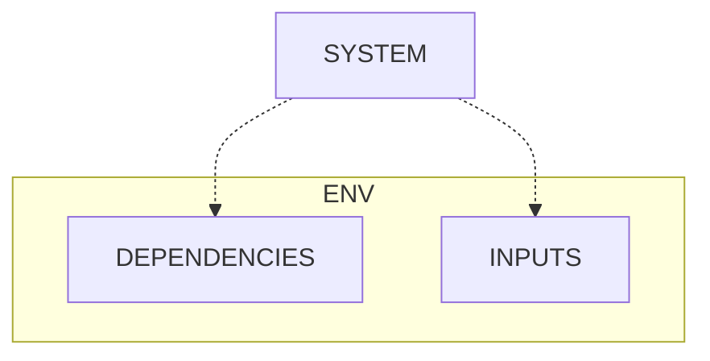

# Methodologies in Cause Analysis

## Models

### Principle

#### Causation

Every object is at some state each instant. When an action happens to it, it is changed to another state. An action is a series of states which has a meaning.


The world can be divided into any system and its environment. For an action of a to happen at a system at state A, triggers are needed. Triggers can be internal or external. 

Internal triggers are conditions met and detected inside the system. In this case, the system starts the action by itself. For instance, in a system of computer, if the OS has detected that some app is using too much resource, it will kill the app. 

External triggers are conditions in its environment and detected by the system. For instance, if an air-conditioning system detects that the temperature of its environment is below some threshold, it hibernates. For a microwave, if it receives power and a starting instruction, it starts to work.

The boundary between a system and its env is relative. Take the example of the microwave again, if we define a system containing all of the microwave, power supply and the operator, then triggers of power and instructions are internal.

#### Rules

The universe is controlled by rules of math and physics. Rules are in a conditional form that **if a condition C, then an action A**.

Accumulated from these basic rules, there are rules of high levels including engineering rules, policies and human thoughts. 

```In terms of stability, rules can be divided to stable rules and human rules.


~~For different types of rules, backwards reasoning focuses on states or actions.~~
##### Stable Rules

Stable rules means rules that are usually treated as correct. These include 
- natural rules which could not be changed.
- engineering rules and policies which stand after long-term tests.	
	
##### Human Rules

Human rules means human thoughts controlling behaviors. For instance, "If my laptop has no response, then I restart it." and "If I want to compare two things, then I put them side by side." are human rules.

Human thoughts contain many misconceptions, and humans might miss out some steps. As a result, in a human-conducted process, it is highly possible that human behaviors introduce problems. 

**But previous states are also considered for cases in which the handled objects are problematic inside.**
```
#### States

For problem analysis, we consider a system at some state and its env.

```==A macroscopic human action will trigger a physical process, visible or microscopic.== Processes can be categorized into single processes and composite ones based on the number of human actions.

##### Single Process

A single process is one involving a single simple human action like pressing a button or no at all like physical or chemical reactions. 
```

##### System

A system has a composite structure. 

Any component in a system including the system itself follows some rules to conduct actions. Then Any component can be divided into 2 parts - the mind and the body.

###### Body

This means the physical hardware like human bodies, laptops and screws.
 
###### Mind

We need to consider factors guiding a component's behaviors.

In general, the mind contains different types of rules for different types of bodies. 
- For humans, the rules are human thoughts.
- For devices, the rules are engineering rules.
- For organizations, the rules are management policies.
- For natural things, the rules are natural rules of math, physics, chemistry and biology. 

For a human, we also consider its mental state including
- views about something
	- percepts
	- induced views
- emotions
- mental disorders including additions.

##### Environment

A system is always inside its environment which might affects the system's behaviors. The environment concerned of a system can be divided into 2 parts - dependencies and inputs.


###### Dependencies

- Energy

	For a system to work in general, some forms of energy are needed. Force is needed to turn a bike. Electricity is needed to light a bulb. Water is needed for transferring water through a pipe. ~~Two numbers are needed for a computer to start an add operation.~~

- Required Services

	Most systems rely on services of other systems to fulfill its functionalities. A social network app needs network services. An online store needs payment services. Any professional needs tools to do it work.

###### Inputs
 
To start a specific process of a multi-mode system, besides energy and required services, additional inputs are required which might be active or passive.
- active triggers, which ask for the process.
	- instructions like pressing a button ~~ or fastening a screw . ==A macroscopic human action will trigger a physical process, visible or microscopic.==~~
- passive triggers, which promote the process.
	- In general, natural factors including 
		- temperatures, moisture, pressure and so on.
		- diseases
	- **for human actions
		- inspirations or temptations.
		- constraints to alternative processes
			- cost


```##### Composite Process

A composite process is one containing multiple human actions.

#### Problem Types

Problems are final symptoms of systems. Problems can be divided into 2 types.

##### Failure

A failure is a broken path. The path could be a flow of force, electricity or signal.

In this case, all components should exist but some are broken. For instance, in the process of powering a machine, both the structure (the machine) and trigger (electricity) should exist.

==A broken point will break the whole path.==

##### Unexpected

A problem of this type is an path that should not exist.

In this case, some components of the system should not exist. For instance, in the process of germs consuming foods, the structure (germs and foods) should not exist. In another process of oomd killing chrome, the structure (oomd and chrome) should be there, but the condition to kill chrome in oomd's policies (when chrome's memory usage exceeds 60% of all memory) should not be met.
```
### Backward Reasoning

backward root cause reasoning starts from the final symptoms **to find the chain of causes.**


Backward reasoning is used to find a meaningful process resulting in the current state, and then the previous state triggering the process. It is the general method to find causes.

#### Starting Points

Start the whole cause analysis process from the effects of the problem on us. For instance, An effect is the itchy feeling not the existence of mosquitoes.

#### Find the paths

1. Because symptoms are a human's perception, we need to firstly check whether or not the person's receptors of five senses work well.

1. ~~start from a find the final state of the system, and~~ From a state, find the process resulting in it, then the previous state. Localize to problematic components. 
2. For each problematic component, repeat the tracing-back procedure recursively UNTIL it is a misconception in human thoughts or **natural aging**.== 

##### Focus

A process might involves both topics of engineering and human behaviors. At each process, we only focus on one topic.
 
Put things that we want to focus on in a process into the system part.


##### Step Size

It is easy to summarize a complex process with a generalized phrase like a laptop boots. However, to localize the problem, we need to specify steps. Different step sizes are efficiency for different cases.

In the case of analyzing problems in an unfamiliar field, steps of small sizes are better. One process then involves a subject acting on an object. The action is usually a simple physical / engineering action involving transfer of energy or information. Simple actions includes water overflowing, pressing a tape and so on. If we take a large step when we are not clear of the mechanisms, we might ignore some factors. 

If we have already understanding the whole picture and mechanisms of a system, we can choose  steps of a lager size. In this case, one process involves multiple components interacting sequentially. For instance, we can group the communication from the CPU/MEM to PCI to SATA together after we know a write to the disk must go along this path.

Notice if a system involves a large number of components, we might get lost when trying small steps. For this types of problems which are common in engineering, a top-down approach is better. We then need to learn the system structure firstly. 

#### Trouble Shooting

Trouble shooting is a process in which we localize the problem in order to minimize the cost of repair.

After localizing the problem from a whole system to a component, we narrow the problematic previous state. For instance, we might narrow the checking range from a group of human actions to a single one.
 
```##### Problematic Steps

For a composite process, trouble shooting is used to find problematic steps in the process. To do it,

1. specify the process as **no more than 5** steps.
	- forwards if we have a plan
	- backwards otherwise
2. check steps forwards, and find the **first** problematic step that has a bad result.   
3. recursively do above procedure to the problematic step till a step is a single action.

However, there are some challenges to this procedure. 

1. If there are more than one steps introducing problems, there will be multiple test-repair cycles.
2. Sometimes a wrong step will not have direct bad result, and the problem becomes visible later. For instance, The miss-out of cleaning surfaces before applying tapes will introduce dust in the interface, which is however invisible by eyes. And the fallout of the tape will happen days later. 

To handle these challenges, guild lines are desirable to help us to spot all possible problematic steps caused by behaviors at once.
   
If eventually we find that the process is correct and the problem is from the previous state, which means that environment makes the process hard to achieve the required effect, suck as tools used are too weak or not flexible, then continue backwards reasoning.

##### Problematic Components

For a single process, trouble shooting is used to find problematic components of a system recursively. Because stable rules are correct, if a state is problematic, then the previous state before the process is **possibly** problematic. 

> Notice: natural aging is taken into consideration. 
```
##### Possible Factors

Notice that we **cannot** change natural rules.

- System
	- composite component
		- any component or interface
		- **wrong policies / configurations**
			- the whole module is disabled
	- leaf component
		- body
			- missed
			- weak strength
			- deformed
			- wrong function (for units whose problems cannot be seen from out appearance likes electronic devices.)
		- mind
			- misconceptions
				- unconsciousness
					- missed steps
						- clean-up
					- inappropriate manners
						- intensity
						- angle
						- pace
				- being less informed
			- wrong policies
			- mental
				- negative emotions 
				- disorders
	- interface ~~(mainly for engineering problems)~~
		- mismatched form factors
			- mental: no enough examination of the object
		- loosen or separated or disposition 
			- natural aging
			- external interruption
		- impurity
			- dust & dirt
- Environment
	- dependencies
		- energy
			- weak
			- over
			- unstable
		- relied services
	- inputs
		- active
			- wrong instruction / operation
			- wrong data
		- passive
			- appropriate nature matrix
			- temptations
			
  ~~- human action
		- missed
			- not enough clean-up procedure.
		- additional
		- different		
		- inappropriate manners
			- intensity
			- angle
			- pace~~
			
	
##### Procedure

1. **organize involved components**
	- system structure	
		- study from materials **if**
			- the location of a system is hard to reach. For instance, a bulb attached to the ceiling.
			- a system is encapsulated & disassembling it is risky like electronic devices.
		- examine the structure with goal orientation in which we firstly think what the system needs and then find the component implementing the functionality.
	
	- *environment*

2. **find the contributing ones**. 
```	- For problems of failure, because components of a system should be here, we localize **ALL** problematic component to an atomic level, from which we reason its causing process.
	- For unexpected problems, we find **ALL** components that should not exist, and then reason back from each of these components individually.
	
	Sometimes components with symptoms are NOT where the problem is. For mechanical problems, a broken component can be caused by its weakness or that the force acting on it is too large. Notice that the amount of force will change during transmission by devices like levers even if the initial human force is suitable. 
```	  
3. for a problematic component, repeat above steps till the current component is atomic, which means that the cost of repairing its components is greater than that of replacement of whole one.
 
Trouble shooting has many benefits.
- reduces the cost of repair the system
- narrows down the range of causes from that of the whole system to that of a component, which simplifies further backwards reasoning.
- simplifies the analysis of the system in a static view.
 


##### Localization Level

To localize to a level where the cost of replacement is less than that of repair like:
- an atomic level
	- engineering units like chips and screws
	- a single physical action like pushing a button
- repair is far out of my current knowledge or control like close-source apps

#### Summary

- Backwards reasoning to build a path of individual processes.
- Trouble shooting to localize problematic parts in a process.

## Proof

To prove a possible cause Y, there are 3 types of pathes.

### Cause

A path from Y's cause X to Y.

#### Process

Evidence of a process X which can cause Y. 

#### Related Objects

Evidence of other objects which can be produced along with Y by X.

### Hypothetical Deduction
		  
A path from Y to another possible symptom Z besides the current problem.

### Test

We can directly test Y. There are 2 types of tests.
- date from others.
- unit tests by ourselves.

#### Reference

We can refer to others' test results, which needs extremely caution about fake evidence.

#### Unit Tests

Unit tests are to test Y by ourselves.

##### Principles
- Any component broken will make the whole path broken.

- It is rarely possible that two independent things break at the same time.
  
For example, for a broken path P, if the problem is still here after replacing a component A with an alternate A', then the probability that the problem is inside the part P - A is much higher than the probability that both A and A' are problematic.

There are 2 challenges in finding contributors of a problem. 

Firstly, whether a part is problematic.
- Macro ones can be caught easily with five senses, like a loosen screw, a deformed gadget and cracks in mechanics.
- Micro ones not, like electronic units and chemicals.

Secondly, even if a part is problematic, it is NOT 100 percent that this part really causes the final problem. For instance, a machine might still work well when a screw is loosen or rusted. It is the degree of being problematic and combination with other factors that decide the effect.

Unit tests can decide both **the existence of a factor** and **the causation relationship between the factor and the outcome**. When replacing a component with one already verified good,
- if the problem disappears, then this component is both problematic and causing the bad result.
- **otherwise, we can only make sure that there is at least one other factor.**

##### Types

###### Positive

A positive unit test is one where we test a suspected part *A* in a new env in which all other parts are good.
- if the system works well, then A is good or bad, but not causing the problem.
- else A is bad, and causing the problem.

**For software systems, positive unit tests are easy to conduct.** We can mock all its dependencies and the caller.

For Hardware systems, they are hard.
- for engineering, we need to replace all other parts, which is expensive.
- for medical problems, it is inapplicable. We can not unit test an organ.

###### Negative

A negative unit test to a part is one test where we replace it with a verified good part. This test essentially positively tests the whole rest.

It is easier to conduct than the positive type. When we highly suspect a component, we can replace it only, then test the system.

###### Finding a working path

A system contains multiple components. To narrow down test scope, we can utilize the current system to do pseudo unit test. If a component can handle multiple case like an electronic unit can handle different data, we try to find a working case. For instance, the path of a failed write involves CPU, PCI BUS and SATA. If keyboard typing works which involves the Keyboard, USB BUS, PCI BUS and CPU, then we know that CPU and PCI work, and the problem is inside SATA. 

### Combination

1. collect evidence of five senses for different components.

2. start from the least possible ones, use pseudo unit tests to rule out most.

3. If there are more than 1 candidates left, use negative unit tests from the cheapest one. For instance of the write failure problem, if both the SATA adapter and SATA device are still possible, try to replace the SATA device firstly as replacing the SATA adapter needs to replace the whole mother board.

### Multiple Factors

If there are multiple factors contributing to the problem, we need to handle them all.

Fortunately, for engineering problems, there will be usually only one factor. If a system suddenly stops working, it is the most possible that only one component is broken according to possibility. Exceptions are when the machine has not been used for long or is physically damaged seriously.

However, biological problems are caused by many factors. 

In cases where there might be many factors, pseudo unit tests are less effective as maybe the accumulated effect causes the outcome. To handle this situation, we handle all factors by repairing them.

Even if a problematic component is not related to this problem, it is better to repair it if we notice it like the case of a loosen screw. One of reasons that it has not caused a problem might be its minor degree. As time goes by, the component gets worn more. Repairing it now could prevent problems.  


## Problem Examples

#### physiological problems
- [x] mold smell
	```mermaid
		flowchart BT
			SMELL
			MOLDS_CONSUME_FOODS --> SMELL
			subgraph MOLDS_ENV
				TEMP
				MOISTURE
				LIGHT
				AIR
			end
			MOLDS_ENV -->|molds| MOLDS_CONSUME_FOODS
			STORAGE -->|foods| MOLDS_CONSUME_FOODS
		    
	```
- [x] rotten smell in the kitchen
	```mermaid
		flowchart BT
				SMELL
				BACTERIAS_EAT_FOODS --> SMELL
				subgraph BAC_ENV
					TEMP
					WATER
					LIGHT
					AIR
				end
				BAC_ENV -->|bacterias| BACTERIAS_EAT_FOODS
				NOT_CLEAN -->|foods| BACTERIAS_EAT_FOODS
	```
- [x] bad sleep
	```mermaid
			flowchart BT
				SLEEP_INTERRUPTED
				failed_GOOD_SLEEP_ENV --> SLEEP_INTERRUPTED
	```
	A good sleep env:
	- external
		- temperature: cool
		- light: dark
		- sound: quite 
	- internal
		- short-term
			- breath: fluent
			- stomach: not empty
			- posture: comfortable
			- bladder: empty
		- long-term
			- biological clock
			- related diseases  
					
#### engineering problems 
- Mechanics
	- Bike
		- [x] brake disc adjustment to avoid friction
			```mermaid
				flowchart BT
					FRICTION
					failed_DISC_PARALLEL_CATCHERS --> FRICTION
			```
			DISC
			: - disc: well-formed
			  - flat
			  - perpendicular to the hub axis
			  - fastener: tight 
				
			CATCHERS
			: stable
			
			INTERFACE
			: parallel
             - [x] speed shifter system 
          
	- Chair
		- [x] rubber strip fastener
			```mermaid
				flowchart BT
					failed_GAP_CATCH_STRIP --> STRIP_OUT
			```
			GAP: 
			- strong
hard
			- not broken
			    
			STRIP:
			- elastic
			- not broken
				
			CATCH:
			- match
			- tight	
			- no pull
- Electronics
	- Laptop
		- Cannot write to the disk. Find the broken component.
			```mermaid
				flowchart BT
					failed_WRITE_PROCESS --> DISK_WRITE_ERRORS
			```
			CPU:
			PCI:
			Sata Controller:
			Sata Device: well functional
			Interfaces: not loose
				
#### psychological & behavioral problems

- forget the phone
	```mermaid
			flowchart BT
				PHONE_LEFT
				subgraph forgot
					ZHOU_FORGOT_PHONE 
					NO_CHECKING_IDEA
					PHONE_IN_MOTORBIKE
				end
				ZHOU_FORGOT_PHONE --> PHONE_LEFT
					NO_CHECKING_IDEA --> ZHOU_FORGOT_PHONE
					PHONE_IN_MOTORBIKE --> ZHOU_FORGOT_PHONE
				subgraph put
				ZHOU_PUT_PHONE --> PHONE_IN_MOTORBIKE
				UNCOMFORTABLE --> ZHOU_PUT_PHONE
				PHONE_WITH_HIM --> ZHOU_PUT_PHONE
				end
				subgraph bring
				ZHOU_BRING_PHONE --> PHONE_WITH_HIM
				USAGES --> ZHOU_BRING_PHONE
				PHONE_AT_HOME --> ZHOU_BRING_PHONE
				end
	```
- anxiety of differencies
	```mermaid
			flowchart BT
				ANXIETY
				I_WORRY_DIFFERENCES --> ANXIETY
				BAD_PREDICTION --> I_WORRY_DIFFERENCES
				DIFFERENCES --> I_WORRY_DIFFERENCES
				MEMORY_LOSS --> DIFFERENCES
				KNOW_OUTDATED --> DIFFERENCES
	```	
	
## Removal of Causes

- removal
	-	replacement
		- hard: replace the physical object
		- soft: turn on / off it	
	-	repair
		-	remove a component / interface
		-	change an attribute
		-	change the action	

**By changing touchable physical objects** to remove causes. 
- ==This removal means that the object is present here.== 
- ==To avoid its presentation is prevention.==

### Component

To repair a broken path, we need to repair every broken point.

To break a path that should not exist, we only need to break it at one point. However, for many problems in reality, multiple factors have accumulated effects. As a result, it is better to handle all the most contributing ones.

### Action

For a bad action, the most efficient way is to change the rule.
 
For actions, there are 3 cases in terms of the subject.
- if the subject is a human, remove
	- thought by external reminders.
	> Notice: 
	> - to prevent the thought, change the person's environment to help the person be more informed.    
	> - not try to change the subject brutally.
	- its environment by external forces
		- change the object's state
		- import external constraints
	- **When I know of the good action and bad action but still give in to the bad one, there must be some triggers in the environment. Examine the env to find the key factors and adjust the good one to be more acceptable.**
		
-	if the subject is a nonhuman but organism, remove thought, **itself** or its env. 
-	if the subject is a nonliving physical object, then the thought is actually physical rules which cannot be altered. In this case, remove itself or env.

For interactions in which multiple components mix up like those in biology, focus on components not interfaces.

### Conflict

When the goal consists of multiple sub goals which conflict, reason from sub goals to find   where the conflict is.

**Remember**
- Everything in reality is at a spectrum and not in a binary situation.
- Do not let perfect be the enemy of good.

Our current problem is that some of these sub goals are little met. Try to adjust situations to make all sub goals are at least middle met if not highly met.

<!--stackedit_data:
eyJoaXN0b3J5IjpbMTk5MzI2NjIwMywtODY1NTI2NjQwLC0xMz
I3NzI4Mjc0LDI5MDk0MDUxOV19
-->