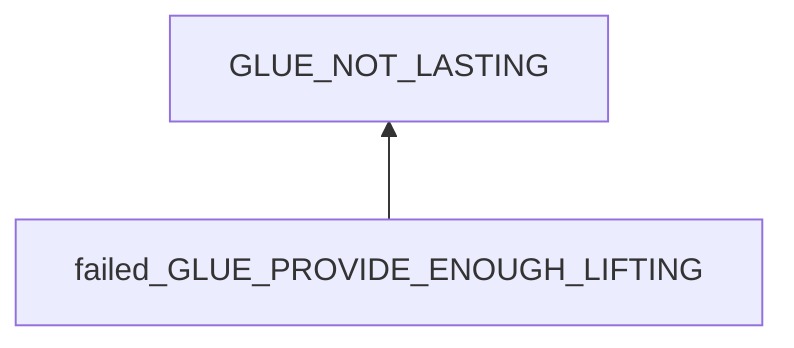
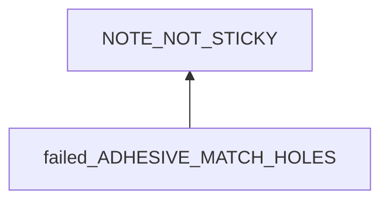
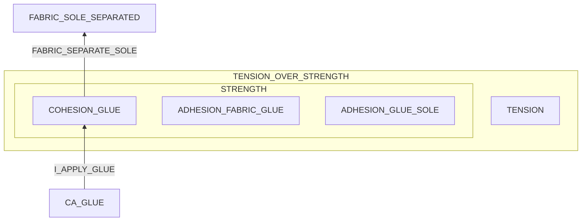
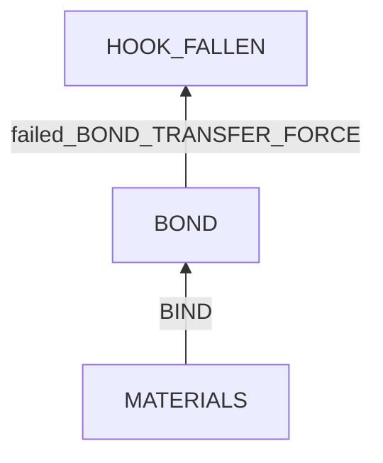

# Glue Not Sticking For Long

## Examination
[problem overview]: #
[a problem can be the output or input of a process. For output, it can be a bad output. For input, it can be a waste of resources]: #

The glue/adhesive does not work.

### Context

#### When
[Specification: year, season, daytime, during & after some events, duration]: #

After applied for days or weeks.

#### Where
[Localization]: #

### Symptoms
[avoid biases]: #
[comparison between actuation and expectation]: #
[collect evidence used by hypothesis built in the root cause analysis phrase]: #
[specification: location, degree]: #

#### Vision

- Sticky notes
	- Corners are lifting.
	- detached and fallen.
	- **[GOOD_NOTES]** For good ones, they can stick for months.
	- For bad ones, they might fall in a day.
- Shoe adhesive
	- My sneakers still crack at front-left corner after using 502 glue.
- Wire hooks
	- At kitchen
		- One unloaded sticker still sticks firmly to the tile wall.
		- 3 loaded stickers fell from wall to the table with the wire.
			- **[PAD_ON_HOOK]** the sticky pads still sticks to the plastic hooks.
			- **[NO_GLUE_ON_TILE]** no adhesive on walls.
	- At work space
		- 4 unloaded sticker still stick firmly to the wall.
		- 3 loaded stickers fell from wall to the table with the wire.
			- **[PAD_ON_WOOD]** the sticky pad of 1 of them still attaches to the wood wall. 
			- **[NO_GLUE_ON_HOOK]** no adhesive on hooks. 
		- 2 stickers initially sticking on the table are still fixed at the locations.
- Glove patches
	- The outer patch is missed.
	- The inner one is shifted.
- Seat patches
	- The patch is missing.
	
#### Hearing

#### Smell

#### Taste

#### Touch & Feel

- Unused sticky notes becomes less sticky.

## Root Cause Analysis
[backward cause reasoning for general problems]: #
[interactions: failed good OR bad OR side effects]: #
[recursive trouble shooting for engineering problems to an atomic level (build hypothesis, use evidence (examination  + unit tests))]: #

failed_GLUE_PROVIDE_ENOUGH_LIFTING
:	GRIP_failed
	:	adhesive forces are not enough.	
	
		INTERFACE_MISMATCH
	
		LOOSEN
		
	STRUCTURE_broken
	:	cohesive forces not enough.

		FORCE
	
		WEAK
		:	CHEMICAL_PROPERTY
			
			IMPURITY
			
			ENV
			:	HEAT
			
				WATER
	

### Sticky Notes

failed_ADHESIVE_MATCH_HOLES
:	Sticky notes use mechanical forces.

	Evidence
	:	Pos
		:	- **[GLASS]** Not working well on glass which is too smooth.

	NOTE_ADHESIVE_NOT_ENOUGH
	:	The amount of adhesive on the sticky note is not enough.

		Evidence
		:	Pos
			:	- I pull a sticky note from its bottom line, which might damage the sticky area.

	~~NOT_MATCH~~
	:	Holes on the surface of the columns are too small or large.
		
		Evidence
		:	Neg
			:	- **[GOOD_NOTES]**
			 
	COLUMN_HOLES
	:	Holes are covered by dirt.
	
		Evidence
		:	Pos
			:	- I have never clean the surface for years.
	
### Sneaker Glue

TENSION_OVER_STRENGTH
:	~~TENSION~~
	:	Tension is too strong.

		Evidence
		:	Neg
			:	- no wearing or pull.

	STRENGTH
	:	Strengths are too weak.
		
		~~ADHESION_FABRIC_GLUE~~ COHESION_GLUE ~~ADHESION_GLUE_SOLE~~
		:	The weakest is cohesion.
			
			Evidence
			:	Pos
				:	- After test by pulling apart a bond, the glue layer is damaged the most.

I_APPLY_GLUE
:	~~CLEAR~~
	~~APPLY~~
	
	CURE
	:	no enough time to cure.
	
		Evidence
		:	Pos
			:	- The needed is 24 hours, but I handle the sneakers after 1 hour.	

CA_GLUE
:	CA glues are not suitable for repairing sneakers.

	Evidence
	:	Pos
		:	- CA glues are brittle and have weak shear strength.

### Wire hooks

BOND
:	HOOK
	HOOK_ADHESIVE
	ADHESIVE
	ADHESIVE_PAD
	PAD
	ADHESIVE_WALL
	WALL

BIND
:	CLEAR
	PRESS
	CURE
	
#### Wood Walls
BOND	
:	HOOK_ADHESIVE
	:	Adhesive force between the hook and adhesive is the weakest.
		
		Evidence
		:	Pos
			:	- **[PAD_ON_WOOD]**
				- **[NO_GLUE_ON_HOOK]**

BIND
:	steps are missed.

	CLEAR
	CURE
	
#### Tile Walls
BOND	
:	HOOK_ADHESIVE
	:	Adhesive force between the tile wall and adhesive is the weakest.
		
		Evidence
		:	Pos
			:	- **[PAD_ON_HOOK]**
				- **[NO_GLUE_ON_TILE]**

BIND
:	some step is missed.

	CURE
	
#### Observation

From above analysis, we know 
$$
ADHESIVE\_TILE < ADHESIVE\_HOOK < ADHESIVE\_WOOD
$$

The adhesive works well on porous surfaces.
	
## Brainstorming
[removal of touchable physical objects is applicable]: #
[replacement V.S repair. Localize the problem to an atomic level where fixing it components is more expensive than replacing it as a whole]: #

NOTE_ADHESIVE_NOT_ENOUGH
:	To tear a note by pulling it **at the edge of the sticky area** smoothly. <1>

COLUMN_HOLES
:	To clean columns regularly and **before applying notes on them.** <2>

STRENGTH
:	Use other ways of fastening to improve strength like sewing. **<3>**

CURE
:	handle the rules
	-	treatment: external reminders like notes **<4>**
	-	prevention: update the rules by practicing to check cure time. **<5>**

CA_GLUE
:	use PU. **<6>**

WOOD_BIND
:	remember to add 2 steps in bind hooks to wood walls. **<7>**
	- clear surfaces of hooks
	- wait enough curing time

TILE_BIND
:	remember to wait enough curing time. **<8>**
 
WOOD_MATERIAL
:	HOOK
	:	add a layer of dried CA glue on the surface of hooks to make it porous. **<9>**

	ADHESIVE
	:	use a stronger one. **<10>**
TILE_MATERIAL
:	

## Analysis of Solutions

### Comparison
| Solution | Cost | Effective Duration | Side Effects & Risks |
| --- | --- | --- | --- |
| 1 | LOW | ? | NOT_WORKING |
| 2 | LOW | ? | NOT_WORKING |
| 3 | LOW | LONG | SOLE_LEAKING_WATER |
| 4 | LOW | LONG | LOCAL |
| 5 | LOW | LONG | FORGET |
| 6 | MIDDLE | ? | ? |
| 7 | LOW | ? | NOT_WORKING |
| 8 | LOW | ? | NOT_WORKING |
| 9 | LOW | ? | NOT_WORKING |
| 10| MIDDLE | ? | HARD_REMOVE|

### Priority & Trace

- *1, 2*
	[Fri Aug 18 01:18:19 PM CST 2023] applied this method the first time.
	[Fri Aug 25 06:00:45 PM CST 2023] still attaching firmly.

- *5*
- *6*
	
## Thinking
[Lessons learned from this experience]: #
- What standards are used to determine the validation duration of a product?
- An action which might cause a situation can be used as evidence: highly related.

<!--stackedit_data:
eyJoaXN0b3J5IjpbLTU4ODk3MTE1N119
-->