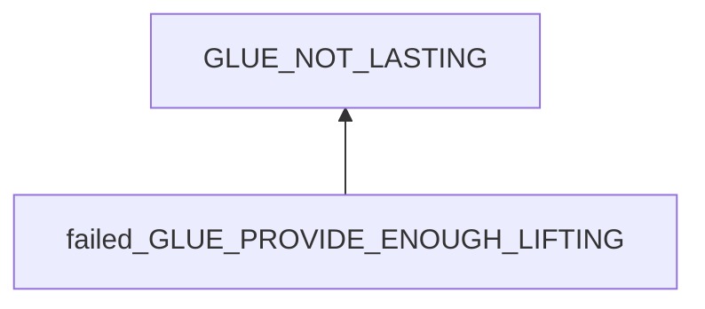
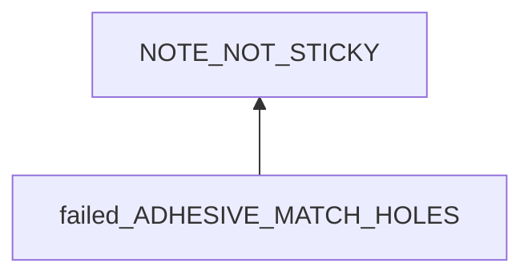
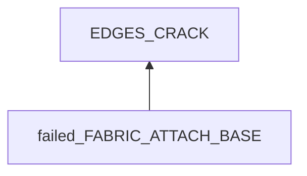
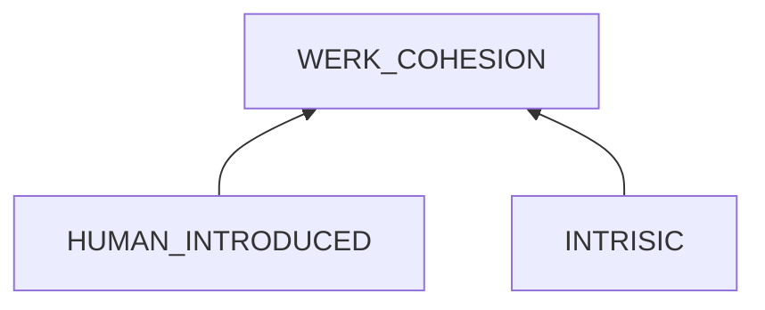

# Glue Not Sticking For Long

## Examination
[problem overview]: #
[a problem can be the output or input of a process. For output, it can be a bad output. For input, it can be a waste of resources]: #

The glue/adhesive does not work.

### Context

#### When
[Specification: year, season, daytime, during & after some events, duration]: #

After applied for days or weeks.

#### Where
[Localization]: #

### Symptoms
[avoid biases]: #
[comparison between actuation and expectation]: #
[collect evidence used by hypothesis built in the root cause analysis phrase]: #
[specification: location, degree]: #

#### Vision

- Post-it notes
	- Corners are lifting.
	- detached and fallen.
	- **[GOOD_NOTES]** For good ones, they can stick for months.
	- For bad ones, they might fall in a day.
- Shoe adhesive
	- My sneakers still crack at front-left corner after using 502 glue.
- Wall stickers
	- At kitchen
		- One unloaded sticker still sticks firmly to the wall.
		- 3 loaded stickers fell from wall to the table with the wire.
	- At work space
		- 4 unloaded sticker still stick firmly to the wall.
		- 3 loaded stickers fell from wall to the table with the wire.
		- 2 stickers initially sticking on the table are still fixed at the locations.
- Glove patches
	- The outer patch is missed.
	- The inner one is shifted.
- Seat patches
	- The patch is missing.
	
#### Hearing

#### Smell

#### Taste

#### Touch & Feel

- Unused sticky notes becomes less sticky.

## Root Cause Analysis
[backward cause reasoning for general problems]: #
[interactions: failed good OR bad OR side effects]: #
[recursive trouble shooting for engineering problems to an atomic level (build hypothesis, use evidence (examination  + unit tests))]: #

failed_GLUE_PROVIDE_ENOUGH_LIFTING
:	GRIP_failed
	:	adhesive forces are not enough.	
	
		INTERFACE_MISMATCH
	
		LOOSEN
		
	STRUCTURE_broken
	:	cohesive forces not enough.

		FORCE
	
		WEAK
		:	IMPURITY
	
			MOLECULE_MESS
			
			ENV
			:	HEAT
			
				WATER
	

### Sticky Notes

failed_ADHESIVE_MATCH_HOLES
:	Sticky notes use mechanical forces.

	Evidence
	:	Pos
		:	- **[GLASS]** Not working well on glass which is too smooth.

	NOTE_ADHESIVE_NOT_ENOUGH
	:	The amount of adhesive on the sticky note is not enough.

		Evidence
		:	Pos
			:	- I pull a sticky note from its bottom line, which might damage the sticky area.

	~~NOT_MATCH~~
	:	Holes on the surface of the columns are too small or large.
		
		Evidence
		:	Neg
			:	- **[GOOD_NOTES]**
			 
	COLUMN_HOLES
	:	Holes are covered by dirt.
	
		Evidence
		:	Pos
			:	- I have never clean the surface for years.
	
### Sneaker Glue

failed_FABRIC_ATTACH_BASE
:	According to tests
	$$
	Adhesion(fabric, glue) > Adhesion(glue, base) > Cohesion(glue)
	$$
	

		
HUMAN_INTRODUCED
:	DIRT
	AIR_POCKETS
	ALIGNMENT_MESS
	AMOUNT
	
## Brainstorming
[removal of touchable physical objects is applicable]: #
[replacement V.S repair. Localize the problem to an atomic level where fixing it components is more expensive than replacing it as a whole]: #

NOTE_ADHESIVE_NOT_ENOUGH
:	To tear a note by pulling it **at the edge of the sticky area**. <1>

COLUMN_HOLES
:	To clean columns regularly and before applying notes on them. <2>
 

## Analysis of Solutions

### Comparison
| Solution | Cost | Effective Duration | Side Effects & Risks |
| --- | --- | --- | --- |
| 1 | LOW | ? | NOT_WORKING |
| 2 | LOW | ? | NOT_WORKING |

### Priority & Trace

- 1, 2
	[Fri Aug 18 01:18:19 PM CST 2023] applied this method the first time.
	
## Thinking
[Lessons learned from this experience]: #
- What standards are used to determine the validation duration of a product?

<!--stackedit_data:
eyJoaXN0b3J5IjpbMTY5NTYwODk0MF19
-->