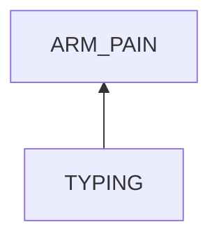
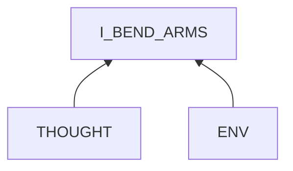

# Arm Pain in Typing

## Examination
[problem overview]: #

My arms feel painful and sour.

### Context

#### When
[Specification: year, season, daytime, during & after some events]: #

-	**[DURING_TYPING]** When typing for 30 seconds.

#### Where
[Localization]: #

- arms.

### Symptoms
[avoid biases]: #
[comparison between actuation and expectation]: #
[collect evidence used by hypothesis built in the root cause analysis phrase]: #
[specification: location, degree]: #

#### Vision

-	I bend my arms when typing.
-	**[ARMS_HUNG]** I tend to get my arms off my body and hung in the air.

#### Hearing

#### Smell

#### Taste

#### Touch & Feel

-	**[ARM_OUTWARD]** the extremely sour feeling when moving arms outward further.

## Root Cause Analysis
[backward cause reasoning for general problems]: #
[recursive trouble shooting for engineering problems to an atomic level (build hypothesis, use evidence (examination  + unit tests))]: #

TYPING
:	I_BEND_ARMS
	:	The action that I bend arms causes the feeling.
		
		Evidence
		:	Pos
			:	-	Bending down for a while causes a sour feeling.
				-	Bending legs when sleeping causes uncomfortable feeling.
				-	When the pain appears, stretching arms forward relieves it instantly.
				-	**[ARMS_HUNG]** This change decreases the level of bending.

THOUGHT
:	I have no idea of how to use muscles correctly.

ENV
:	KEYBOARD_POSITION
	:	The keyboard is near my body.

	WRISTS_HUNG
	:	Arms bent to lift wrists.
	
## Brainstorming
[removal of touchable physical objects is applicable]: #
[replacement V.S repair. Localize the problem to an atomic level where fixing it components is more expensive than replacing it as a whole]: #

THOUGHT
:	learn systematic knowledge. **<1>**

KEYBOARD_POSITION
:	move it to a far position. **<2>**

WRISTS_HUNG
:	 rest wrists on somethings. **<3>**

## Analysis of Solutions

### Comparison

| Solution | Cost | Effective Duration | Side Effects |
| --- | --- | --- | --- |
| 1 | MIDDLE | LONG | LITTLE |
| 2 | LOW | LONG | **<HOLDING_ARMS>**|
| 3 | LOW | LONG | HINDER:	It hinders the movement of hands. |

**<HOLDING_ARMS>**
:	This method enables the whole arm and hand in a straight line, which however needs supports.
	-	If letting muscles to support the posture, it takes energy and brings pain.
	-	external supports
		- supporting wrists:	hindering movements.
		- supporting arms:	additional equipment with considerable heights needed.
		 
### Priority & Trace

-	*1*
-	*2*

	It makes arms relaxed to put them on soft tissue paper packages. But they hinder hands' movement.
	
-	3

## Thinking
[Lessons learned from this experience]: #
-	When reasoning in an unfamiliar field, the whole process is just repeating a step, we can find clues from
	-	systematic learning 
	-	examine the posture, and think about which actions cause similar results.
-	**How to handle the trade-off between different approaches?**
-	refinement of solutions: When a solution solves a problem, it might brings new problems.
<!--stackedit_data:
eyJoaXN0b3J5IjpbLTQzMzczNjMyXX0=
-->