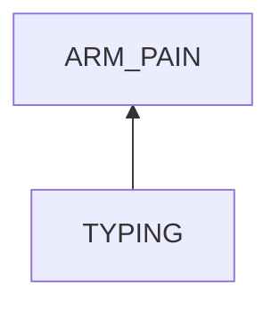
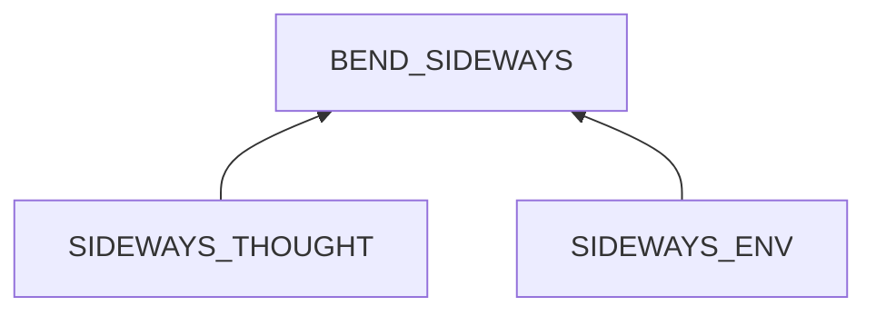
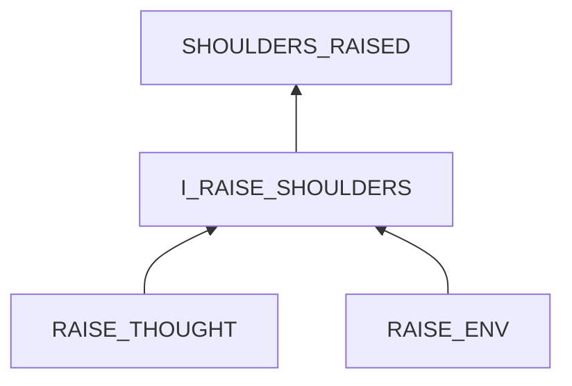
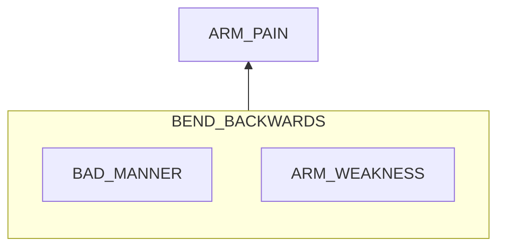

# Arm Pain in Typing

## Examination
[problem overview]: #

My arms feel painful and sour.

### Context

#### When
[Specification: year, season, daytime, during & after some events]: #

-	**[DURING_TYPING]** When typing for 30 seconds.

#### Where
[Localization]: #

- arms.

### Symptoms
[avoid biases]: #
[comparison between actuation and expectation]: #
[collect evidence used by hypothesis built in the root cause analysis phrase]: #
[specification: location, degree]: #

#### Vision

-	I bend my arms when typing.
-	**[ARMS_HUNG]** I tend to get my arms off my body and hung in the air.

#### Hearing

#### Smell

#### Taste

#### Touch & Feel

-	**[ARM_OUTWARD]** the extremely sour feeling when moving arms sideways further.

## Root Cause Analysis
[backward cause reasoning for general problems]: #
[recursive trouble shooting for engineering problems to an atomic level (build hypothesis, use evidence (examination  + unit tests))]: #

TYPING
:	I_BEND_ARMS
	:	The action that I bend arms causes the feeling.
		
		Evidence
		:	Pos
			:	-	Bending down for a while causes a sour feeling.
				-	Bending legs when sleeping causes uncomfortable feeling.
				-	When the pain appears, stretching arms forward relieves it instantly.
				-	**[ARMS_HUNG]** This change decreases the level of bending.
		
		>	Notice:	To main a typing position for a long time, I need to bend arms.
		>
		>	If I switch to stretch my upper arm and forearm to a straight line, 
		>	-	without external supports, it is painful.
		>	-	with external supports, hand movements are hindered.
			 
		BEND_SIDEWAYS
		:	Evidence
			:	Pos
				:	-	**[ARM_SIDEWAYS]**
						
		BEND_BACKWARDS
		:	This bending to hang arms and wrists is necessary to maintain flexibility of hands. But it causes **fatigue**.

			**This fatigue is a side effect to the subject.**
					
			Evidence
			:	Pos
				:	-	After minutes, my arms feel tired and painful even if only bent backwards.
					-	==Arms contain mainly type II B muscle fibers.==
		

SIDEWAYS_THOUGHT
:	Unconsciousness.

SIDEWAYS_ENV
:	FAR_KEYBOARD
	:	When the keyboard is far away, my arms stretch sideways. 	 

	SHOULDERS_RAISED
	:	When shoulders are raising, my arms stretch sideways.

RAISE_THOUGHT
:	unconsciousness

RAISE_ENV
:	HUNCHBACK

	HURRY

BAD_MANNER
:	Arms bent too much.
	
	Evidence
	:	Pos
		:	- The angle between my upper arm and forearm is near 45 degrees.

ARM_WEAKNESS
:	My arms are weak.
	Evidence
	:	Pos
		: 	-  

## Brainstorming
[removal of touchable physical objects is applicable]: #
[replacement V.S repair. Localize the problem to an atomic level where fixing it components is more expensive than replacing it as a whole]: #

BEND_SIDEWAYS
:	move arms back. **<1>**

SIDEWAYS_THOUGHT
:	remember and practice to hang arms near the body. **<2>**

FAR_KEYBOARD
:	move it to near the body. **<3>**

SHOULDERS_RAISED
:	lower shoulders when noticing them. **<4>**

RAISE_THOUGHT
:	remember and practice to relax shoulders **<5>**

HUNCHBACK
:	Keep upper body straight. **<6>**

HURRY
:	relax. **<7>**

BEND_BACKWARDS
: 

## Analysis of Solutions

### Comparison

| Solution | Cost | Effective Duration | Side Effects |
| --- | --- | --- | --- |
| 1 | LOW | SHORT | LITTLE |
| 2 | MIDDLE | LONG | FORGET |
| 3 | LOW | MIDDLE | BEND_BACKWARDS_INCREASED |
| 4 | LOW | SHORT | LITTLE |
| 5 | MIDDLE | LONG | FORGET |
| 6 | MIDDLE | LONG | FORGET |
| 7 | MIDDLE | LONG | FORGET |
	 
### Priority & Trace

-	3
-	6
-	5
-	2
-	7

## Thinking
[Lessons learned from this experience]: #
-	When reasoning in an unfamiliar field, the whole process is just repeating a step, we can find clues from
	-	systematic learning 
	-	examine the posture, and think about which actions cause similar results.
-	**How to handle the trade-off between different approaches?**
-	refinement of solutions: When a solution solves a problem, it might brings new problems.
-	When an interaction has side effects, specify the steps to find which one causes the side effects.
	-	intensity
	-	direction & position	
-	If an intent action leads to a problem, it is possible that 
	-	some of prerequisites of this action are not meet. -> we need to analyse the whole process not just a single step triggering the problem. 
<!--stackedit_data:
eyJoaXN0b3J5IjpbLTE3NDU4NzQ5MjYsLTQzMzczNjMyXX0=
-->