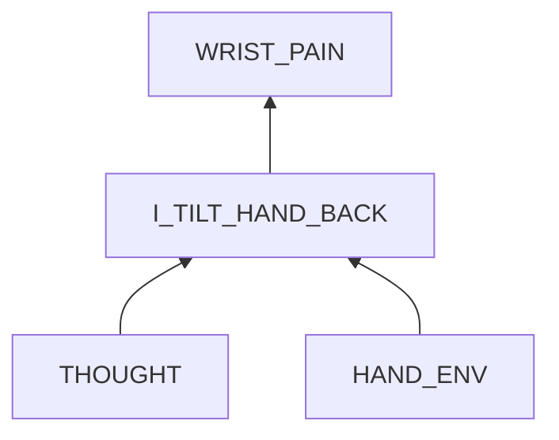

#  Wrist Pain in Typing

## Examination
[problem overview]: #

My wrists feel painful and sour.

### Context

#### When
[Specification: year, season, daytime, during & after some events]: #

-	**[DURING_TYPING]** When typing for 30 seconds.

#### Where
[Localization]: #

-	My wrists 

### Symptoms
[avoid biases]: #
[comparison between actuation and expectation]: #
[collect evidence used by hypothesis built in the root cause analysis phrase]: #
[specification: location, degree]: #

#### Vision

-	My wrists get close to the table gradually.

#### Hearing

#### Smell

#### Taste

#### Touch & Feel

-	**[WRISTS_LIFT]** Lifting my wrists up relieves pain in wrists.
-	**[MORE_HAND_TILT]** The feeling gets more intensive when hand tilt degree increases.

## Root Cause Analysis
[backward cause reasoning for general problems]: #
[interactions: failed good OR bad OR side effects]: #
[recursive trouble shooting for engineering problems to an atomic level (build hypothesis, use evidence (examination  + unit tests))]: #

I_TILT_HAND_BACK
	:	The act of tilting hands backward causes the sour feeling.
		
	Evidence
	:	Pos
		:	-	**[WRISTS_LIFT]**
			-	**[MORE_HAND_TILT]**
			-	(rationalism: knowledge)
				
~~OTHERS~~
:	Evidence
	:	Neg
		:	-	**[WRISTS_LIFT]**

THOUGHT
:	I know both effects of the bad manner and that lifting wrists up can relieve the pain, **But I still give in to the bad manner gradually**. There must be some triggers in the environment that I ignore.

HAND_ENV
:	triggers.

	DESK
	:	It saves energy to put wrists on the desk, which causes hands tilt back.

		Evidence
		:	Neg
			:	-	**[STAND_TYPY]** I still tend to tilt hands back when typing in standing position
	

## Brainstorming
[removal of touchable physical objects is applicable]: #
[replacement V.S repair. Localize the problem to an atomic level where fixing it components is more expensive than replacing it as a whole]: #

## Analysis of Solutions

### Comparison
| Solution | Cost | Effective Duration | Side Effects |
| --- | --- | --- | --- |
 
### Priority & Trace

## Thinking
[Lessons learned from this experience]: #
-	For senses
	-	avoid removal of neural pathways: sensor --> pathway --> brain
	-	start reasoning from the stimuli.

-	Typing is an good interaction, and arm pain is a side effect.

	**To analyse what I am doing.**

<!--stackedit_data:
eyJoaXN0b3J5IjpbLTEwNjY4Mzc1NzldfQ==
-->