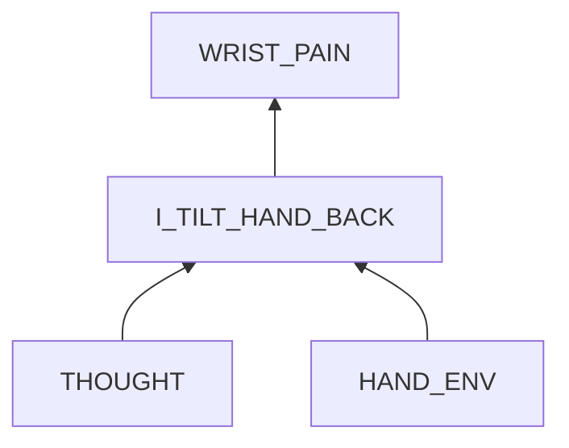

#  Wrist Pain in Typing

## Examination
[problem overview]: #

My wrists feel painful and sour.

### Context

#### When
[Specification: year, season, daytime, during & after some events]: #

-	**[DURING_TYPING]** When typing for 30 seconds.

#### Where
[Localization]: #

-	My wrists 

### Symptoms
[avoid biases]: #
[comparison between actuation and expectation]: #
[collect evidence used by hypothesis built in the root cause analysis phrase]: #
[specification: location, degree]: #

#### Vision

-	My wrists get close to the table gradually.

#### Hearing

#### Smell

#### Taste

#### Touch & Feel

-	**[WRISTS_LIFT]** Lifting my wrists up relieves pain in wrists.
-	**[MORE_HAND_TILT]** The feeling gets more intensive when hand tilt degree increases.

## Root Cause Analysis
[backward cause reasoning for general problems]: #
[interactions: failed good OR bad OR side effects]: #
[recursive trouble shooting for engineering problems to an atomic level (build hypothesis, use evidence (examination  + unit tests))]: #

I_TILT_HAND_BACK
	:	The act of tilting hands backward causes the sour feeling.
		
	Evidence
	:	Pos
		:	-	**[WRISTS_LIFT]**
			-	**[MORE_HAND_TILT]**
			-	(rationalism: knowledge)
				
~~OTHERS~~
:	Evidence
	:	Neg
		:	-	**[WRISTS_LIFT]**

THOUGHT
:	I know both effects of the bad manner and that lifting wrists up can relieve the pain, **But I still give in to the bad manner gradually**. There must be some triggers in the environment that I ignore.

HAND_ENV
:	triggers.

	> Precondition: Curving fingers when resting them in the home row promotes flexibility to reach upper rows in which palms almost do not move.

	
	~~DESK~~
	:	It saves energy to put wrists on the desk, which causes hands tilt back.

		Evidence
		:	Neg
			:	-	**[HUNG_ARM_TYPE]** I still tend to tilt hands back when typing in an above standing position hanging arms freely to touch the keyboard, in which case my arms and wrists are free and do not need a desk to support.
	
	LOW_KEYBOARD
	:	The keyboard is at a low place in terms of my body. To type using fingerprint center with curved fingers, I have to tilt hands backward to make fingerprints horizontal.
	
		Evidence
		:	Pos
			:	-	If I lift the keyboard up **enough**, I can maintain wrists hung and hands not tilt backward naturally for long time.
			
	TOUCH_ANGLE
	:	Currently I use fingerprint center to type, which combined with the keyboard position causes the problem.

		Evidence
		:	Pos
			:	 -	When use finger tips near nails to type, I can make my arm, wrist and hand in a straight line.

## Brainstorming
[removal of touchable physical objects is applicable]: #
[replacement V.S repair. Localize the problem to an atomic level where fixing it components is more expensive than replacing it as a whole]: #

THOUGHT
:	-	treatment:	put external reminders in obvious area of my workspace. **<1>**
	-	prevention:	after this analysis I have a better understanding of how to adjust the keyboard position and finger touch angles. **<2>**

LOW_KEYBOARD
:	> Precondition:	Most desks are of the similar height of 70 cm.
	-	repair:	
		-	lift the keyboard up, like moving it from the desk drawer to the top or even lifting further if the height is not enough. **<3>**
		-	lower my body by
			-	stooping. **<5>**
			-	lowering the chair. **<6>**

TOUCH_ANGLE
:	-	repair:	use finger tips to type. **<4>**

## Analysis of Solutions

### Comparison
| Solution | Cost | Effective Duration | Side Effects  |
| --- | --- | --- | --- |
| 1 | LOW | LONG | MISS-OUT: Maybe I ignore the hints. WORKSPACE-SWITCH: Every workspace of mine needs this reminders. |
| 2 | MIDDLE: practice it. | LONG | LITTLE |
| 3 | LOW | LONG | ARM_ENERGY: When the keyboard is at a high position, maybe additional energy is needed to raise my forearms. |
| 4 | MIDDLE: practice | LONG | LESS_SENSITIVE: Finger tips may be less sensitive and more error-prone.|
| 5 | LOW | LONG | HEALTH:	pressure on my spine. |
| 6 | LOW | LONG | NOT_ENOUGH: Chairs might not be able to adjust low enough. |
 
### Priority & Trace

-	*3*
	
	~~[Sun Jul 23 10:13:55 PM CST 2023] UNPRACTICAL:	To avoid the pain from hands tilt backward, the keyboard needs to be lift up to the height of my chest.~~

-	*1*
-	*2*
-	*6*

	~~[Sun Jul 23 10:41:58 PM CST 2023] UNPRACTICAL:	The chair cannot be adjust low enough to avoid the pain from hands tilt backward.~~

	[Mon Jul 24 12:33:39 AM CST 2023] When combining method 3 and 6, the height of the keyboard is enough to relax wrists.
	
-	*4*
-	5

## Thinking
[Lessons learned from this experience]: #
-	For senses
	-	avoid removal of neural pathways: sensor --> pathway --> brain
	-	start reasoning from the stimuli.

-	Typing is an good interaction, and arm pain is a side effect.

	**To analyse what I am doing.**

-	**When I know of the good action and bad action but still give in to the bad one, there must be some triggers in the environment. Examine the env to find the key factors and adjust the good one to be more acceptable.**  

<!--stackedit_data:
eyJoaXN0b3J5IjpbLTE3ODc2MDY3NTRdfQ==
-->