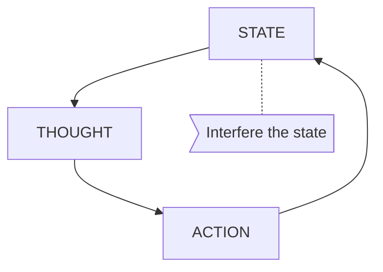

# Name of the problem
## Examination
[problem overview]: #
### Context
#### When
[Specification: year, season, daytime, after some events]: #
#### Where
[Localization]: #
### Symptoms
[avoid biases]: #
[comparison between actuation and expectation]: #
[collect evidence used by hypothesis built in the root cause analysis phrase]: #

#### Vision
#### Hearing
#### Smell
#### Taste
#### Touch
## Root Cause Analysis
[backward cause reasoning for general problems]: #
[recursive trouble shooting for engineering problems to an atomic level (build hypothesis, use evidence (examination  + unit tests))]: #
## Brainstorming
[removal of touchable physical objects is applicable]: #
Human Behavior

Natural Events
STATE MACHINE

[replacement V.S repair. Localize the problem to an atomic level where fixing it components is more expensive than replacing it as a whole]: #
 
## Thinking
[Lessons learned from this experience]: #

<!--stackedit_data:
eyJoaXN0b3J5IjpbLTExMzYwMjgxOTMsMTExMjQ4Nzg3MV19
-->