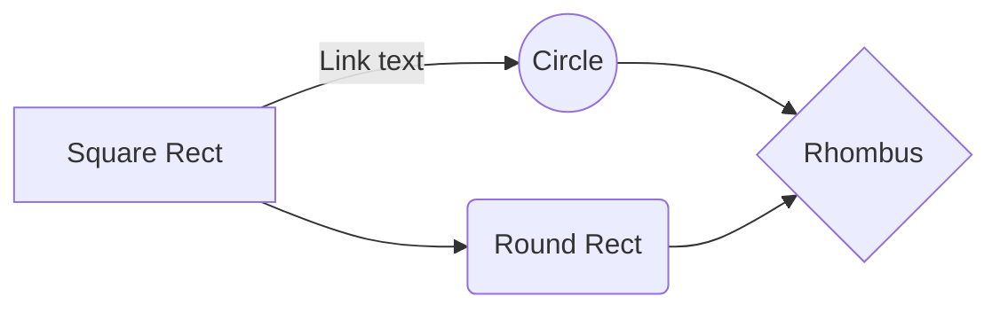

# Goals
- [ ] to catch the purpose and basic layout of each type of diagrams
  - [ ] Structural diagrams
    - [x] class
    - [x] component
    - [ ] composite structure
    - [ ] deployment
    - [ ] object
    - [ ] package
  - [ ] Behavioral diagrams
    - [ ] activity
    - [ ] communication
    - [ ] interaction overview
    - [ ] sequence
    - [ ] state
    - [ ] timing
    - [ ] use case 
- [ ] **UML relationships**  
- to represent flows of
	- mental process
	- mechanism
		-  mechanics
		-  electronics
- to catch the structure (components, connections) of a system

# Questions
- [x] UML V.S mind map
  | Aspect | UML | Mind Map |
  | --- | --- | --- |
  | Purpose | To provide a standard way to visualize the design of systems. Being used to document, design or analyse a system. | To capture main structures and internalize knowledge |
  | Power | Containing many types of diagrams for different usages | Using tree structures to explain a center concept |
  | Easy to use | Hard. Needing to follow strict standards | Easy. The format is relatively flexible |
  | Learning curve | steep | slow |
  | Flow diagrams supported | yes | no |
  | Component diagrams supported | yes | yes |
  
  
- [ ] **different materials of learning UML (**critical thinking**)**
  - [ ] **comparison**
    | Content | lucidchat | tutorialspoint | Visual Paradigm | http://www.cs.sjsu.edu/ | uml-diagrams.org |
    | --- | --- | --- | --- | --- | --- |
    | Purposes | yes | yes| yes |||
    |TOC| yes | no | yes|||
    |Context| yes | yes | yes |||
    |Syntax| partial | no | yes |||
    |Thought steps| no | no | partial |||
    |Examples| yes | partial | yes |||
    
  - [ ] combination 
- [x] **association V.S dependency**
- [ ] aggregation V.S composition
- [ ] flowchart V.S activity diagram
- [ ] activity diagram V.S state diagram
- [ ] flowchart
  - [ ] focusing on states or processes?
  - [ ] can I use it for cause-effect relationships?
- [ ] which diagrams to represent components and connections in a system? 
- [ ] plantUML V.S mermaid

# Test
 
## plantUML

@startuml
Class01 <|-- Class02
@enduml

## mermaid

<!--stackedit_data:
eyJoaXN0b3J5IjpbLTExNzgzNTMxMzMsOTY4NDMyODAzLDE1Nz
YxMzQyNzgsMjEyMjgzNDA1MCwxMDAwOTIyOTY2LC0xNTc5Njg3
NTcwLC0xNDUyNDI1NjY3LC05NTEwMzY4MzVdfQ==
-->